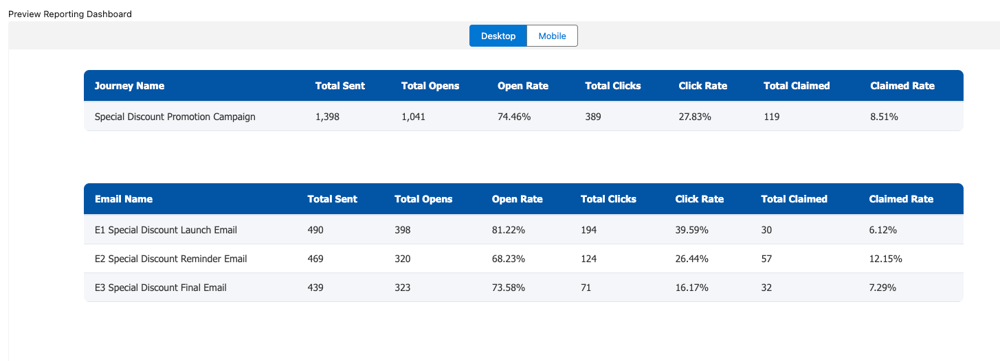

# 📊 Marketing Cloud Campaign Performance Reporting - CloudPage

## Overview

This task showcases a CloudPage built to monitor the performance of an ongoing three-email campaign journey promoting a special discount offer.
Each email in the journey contains a “Claim Now” CTA button that leads customers to a landing page where they can claim their discount code.
The CloudPage displays key campaign metrics in real-time, combining data from SFMC data views and the ClaimedDiscounts Data Extension. This allows the Marketer to view campaign performance metrics as engagement and claims occur. 

---

## Landing Page Functionality

The CloudPage landing page is designed to: 
- Capture user interactions when they click the "Claim Now" button.
- Record and store customer data in a ClaimedDiscounts Data Extension.
- Save the EmailID associated with the claim to identity which email generated the claim.

---

## 📈 Custom Reporting Requirements
The marketer requested a custom dashboard to display performance metrics for each email and overall journey results.
The dashboard provides:

1. Email Reporting Dashboard
  - Total Sent
  - Total Opens
  - Total Clicks
  - Click Rate
  - Total Claimed
  - Claimed Rate

2. Journey Reporting Dashboard
  - Total Sent
  - Total Opens
  - Open Rate
  - Total Clicks
  - Click Rate 
  - Total Claimed
  - Claimed Rate

  ---

## Technologies Used 
- AMPscript
- SQL
- CloudPage
HTML/CSS

---

## Dashboard Screenshot

---

## 👤 Author
Wunmi Ogunbekun

